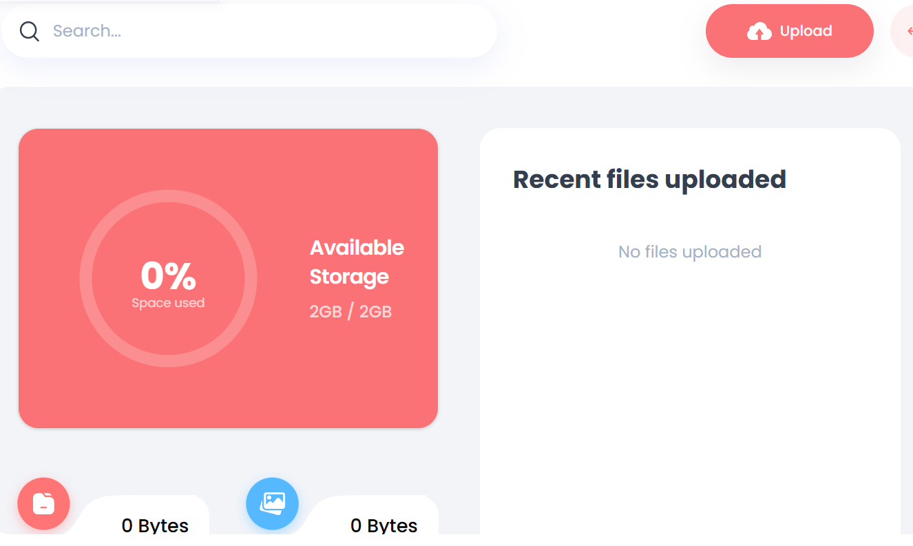

# Drive Storage Solution Mock App

A mock cloud storage solution built with **Next.js**, **TypeScript**, **Appwrite**, and **Tailwind CSS**. This app allows users to upload, manage, and organize files in a cloud-based environment.

 <!-- Add a screenshot of your app here -->

## Features

- **User Authentication**: Sign up, log in, and log out using Appwrite's authentication system.
- **File Upload**: Upload files to your personal storage.
- **File Management**: View, download, and delete files.
- **Responsive Design**: Built with Tailwind CSS for a seamless experience across devices.
- **Type Safety**: Written in TypeScript for better developer experience and code reliability.

## Technologies Used

- **Next.js**: React framework for server-side rendering and static site generation.
- **TypeScript**: Adds static typing to JavaScript for improved code quality.
- **Appwrite**: Backend-as-a-Service for authentication, storage, and database management.
- **Tailwind CSS**: Utility-first CSS framework for rapid UI development.

## Getting Started

Follow these steps to set up the project locally.

### Prerequisites

- Node.js (v16 or higher)
- Appwrite account (for backend services)
- Git (for version control)

### Installation

1. **Clone the repository**

   ```bash
   git clone https://github.com/your-username/drive-storage-mock-app.git
   cd drive-storage-mock-app
2. **Install Dependancies**

   ```bash
   npm i
3. **Enviorment Setup using Appwrite**

   ```bash
    NEXT_PUBLIC_APPWRITE_ENDPOINT="https://cloud.appwrite.io/v1"
    NEXT_PUBLIC_APPWRITE_PROJECT=""
    NEXT_PUBLIC_APPWRITE_DATABASE=""
    NEXT_PUBLIC_APPWRITE_USERS_COLLECTION=""
    NEXT_PUBLIC_APPWRITE_FILES_COLLECTION=""
    NEXT_PUBLIC_APPWRITE_BUCKET=""
    NEXT_APPWRITE_KEY=""
